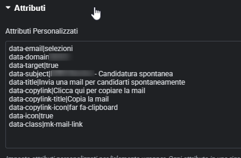
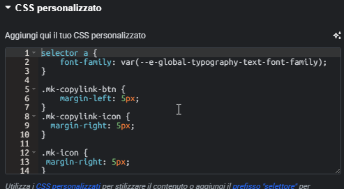

# 📧 WP Shadow Links
*Based on Obfuscated Email Link Generator JS Version 0.1.8*

The original script was primarily created for use in WordPress websites, using **Elementor Pro** or other page builders that make it easy to add "data-attributes" to elements; However, it can be used on any type of website, on plain HTML or Javascript.

This plugin is intended specifically for WordPress, and provide a bunch of easy methods to add email links (and other type of links, it's just a matter of time) that are visible only on frontend and completely absent in the source code of the page.
Doing this, crawlers and spambots can't harvest e-mails addresses or, at least, this make this task more difficult, because it's needed to parse the DOM instead of simply search e-mails addresses in the source code of the page.

## ⭐ Key features

- **Automatic Detection** - Automatically finds and processes elements with email data attributes
- **Flexible Targeting** - Can target specific elements by class or use the source element
- **URL Encoding** - Properly encodes subject and body parameters
- **Validation** - Validates email and domain formats
- **Error Handling** - Graceful error handling with console warnings
- **Accessibility** - Adds title attributes for better accessibility
- **Dynamic Content Support** - Methods for processing dynamically added content
- **Optimized Performance** - Avoids duplicate processing with flags
- **Avoid Spam Bots** - since the HTML code is free from email links (it will be created only in frontend), most of the spam bots, crawlers and data scraping tools can't see the e-mail links, resulting in a reduced possibility to fall into a spam-list  

The script will automatically run when the DOM is loaded and create functional mailto links based on your data attributes.

### Data attributes used for this script
These data attributes must be used when using the plugin in HTML or in a builder data-attributes panel (like Elementor Pro) 

| Data attribute | Required? | Description |
|---|---|---|
|**data-email**     | **Yes**   | **the username part of the email (all the text before the @)**
|**data-domain**    | **Yes**   | **only the domain part (after the @, and without @ itself)**
|data-subject       | No        | the subject of the email 
|data-body          | No        | the body of the email
|data-class         | No        | the class of the element that must be converted to email link
|data-target        | No        | specify if the link should open in a new tab; any value is valid (true,yes, ciao,⭐) because only the presence is really checked
|data-title         | No        | If present, use the text provided as title on hover (for accessibility purposes);if not present, a default text will be used ("Send e-mail to" or "Invia e-mail a" if the site is in Italian)
|data-copylink      | No        | if valorized "true", it adds the button to copy the email in the clipboard and use a default icon for showing the button (FontAwesome far fa-clipboard class is used);<br>if data-copylink-icon is present, use that class instead for a custom icon;<br>If any value other than "true" is used, the text will be used for the button and the icon will be showed only if the data-copylink-icon attribute is present 
|data-copylink-title| No        | Use a custom data-title text for accessibility purpose; if not specified, it uses a default text ("Copy e-mail" and "Copia l'e-mail" if the site is in Italian)
|data-copylink-icon | No        | Use a custom Fontawesome class for the copy email button (default far fa-clipboard)
|data-icon          | No        | If valorized as "true", adds a default icon to the left of the email link, using "far fa-envelope" Fontawesome icon; if valorized with valid class, use that instead
|data-linkwrapper   | No        | If valorized, use that name for the class name attached to the <div> element that contains all the links (mailto and copy button); if not set, the default class name "mk-linkwrapper" will be used


### ℹ️ Attributes for the shortcode method 
Basically, **the same attributes** without the "data-" part are used in the shortcode version; so for example the data-email attribute became ***email***, the data-copylink became ***copylink*** and so on, with the exact same function.

### CSS classes used for custom styling
The styling of the link inherit the styling of the main element where the script runs.

However, if some custom styling is needed, there's some CSS classes for this purpose
| CSS default class name | Can be customized? | Purpose
|---|---|---|
|.mk-icon           | No  | used for the styling of the email link icon (if present); name can't be customized
|.mk-copylink-btn   | No  | used for the styling of the copy email button (if present); name can't be customized 
|.mk-mailto-link    | No  | used for the styling of the <a>
|.mk-linkwrapper    | Yes | used for the styling of the wrapper for the links; useful if you want inline (default) or stacked design. Use **diplay:flex** for maximum flexibility


## 🔐 Security Notes

When adding target="_blank", the script automatically includes rel="noopener noreferrer" for security reasons. This prevents the new page from accessing the window.opener property and protects against potential security vulnerabilities.


### ℹ️ Disclaimer

Please consider I'm not a professional developer, or to say it better: programming is not my main activity.<br>**I'm working in IT since 90's**, I've ever loved to create websites and when **WordPress** has appeared I've choose it to be my main tool. If you plan to use this script in production, please consider to personally review the code and do the necessary changes to accommodate to your case. Or simply, don't use it.

⚠️**The script/plug-in is offered "as-is" without any guarantee, use it at your own risk! ⚠️**

**(sorry, I must say this, there's a lot of bad people out there! 😅)**

### 🤖 AI Disclaimer

As previously stated, I'm not a professional developer and I've used AI (Claude 4 Sonnet) to create and test this script; though, I've personally tested on my environment and I'm feeling confident to use in public exposed sites. Feel free to review, modify, fork, suggest, ignore it or whatever else you want 

## 💾Implement in your site

In WordPress, you can just use a simple plugin like [Code Snippets](https://codesnippets.pro/) and simply copy the JS code as a functional snippet.
If you prefer, you can output the JS code using simple PHP in Code Snippets, like this

```php
/* Javascript starts */
?>
    <script type="text/javascript">

    ... paste the code here ...

    </script>
<?php
/* Javascript ends */
```
If you use **Elementor Pro**, you can also use the Custom Code section and paste the javascript directly here, enclosed in script tags
```html
<script>
    ... paste code here ...
</script>
``` 
this method has the advantage of using conditional loading from Elementor, and you can load it where you want (IMHO, it's better to load it everywhere but it's up to you) 

If you prefer, you can also save the javascript in a .js file, put it where you want in you theme path (better in child theme) and the call it using 

```html
<script src="path/to/your/file.js" type="text/javascript"></script>
```

It's also possible to load in a single page using <script></script> tags; to do this, you can use an HTML block (there's one in Gutenberg, Elementor or in any decent theme builder)

```html
<script>
    ... paste code here ...
</script>
```

The script auto loads itself (see the last lines of the code), and create an object called
**emailLinkGenerator** on which you can call ***refresh*** and ***processElements*** methods.


## ⭐Usage Examples

### Elementor Pro

On a widget like *Text Editor*, *Icon List* or *simple HTML*, point to **Advanced Tab** and in the **Attributes** section adds every data-attribute needed, like in this example image



If you need custom styling only on the page where the widget appears, also paste custom CSS in the **Custom CSS** panel



If your styling must be consistent across your site, it's better to paste the code in the Elementor's custom code section.


### HTML
```html
<!DOCTYPE html>
<html>
<head>
    <title>Email Link Generator Example</title>
    <style>
        .mailto-link {
            color: #0066cc;
            text-decoration: underline;
        }
        .email-button {
            background: #007bff;
            color: white;
            padding: 10px 15px;
            border: none;
            border-radius: 4px;
            cursor: pointer;
        }
    </style>
</head>

<body>
    <!-- Basic email link with default icon -->
    <div data-email="contact" 
         data-domain="yourwebsite.com" 
         data-icon="true" 
         data-class="my-email-link">
    <span class="my-email-link">Email Us</span>
    </div>

    <!-- Example 1: Email link with custom icon and copy button -->
    <div data-email="support" 
         data-domain="example.com" 
         data-icon="fas fa-headset" 
         data-copylink="Copy Support Email" 
         data-class="support-contact">
    <p class="support-contact">Need Help?</p>
    </div>

    <!-- Example 2: Existing anchor tag transformed -->
    <div data-email="info"
         data-domain="company.net"
         data-icon="true"
         data-class="info-anchor"></div>
    <a href="#" class="info-anchor">Get Info</a>

    
    <!-- Example 3: Email link that opens in new tab -->
    <div data-email="john.doe" 
         data-domain="example.com" 
         data-class="email-link"
         data-target="_blank">
        <span class="email-link">Contact John (Opens in new tab)</span>
    </div>

    <!-- Example 4: Email link that opens in same tab (no data-target) -->
    <div data-email="support" 
         data-domain="company.com" 
         data-subject="Help Request" 
         data-body="Hi, I need help with..."
         data-class="support-link">
        <a class="support-link">Get Support (Same tab)</a>
    </div>

    <!-- Example 5: Email button with new tab -->
    <div data-email="sales" 
         data-domain="business.com" 
         data-subject="Sales Inquiry" 
         data-class="email-button"
         data-target="">
        <button class="email-button">Contact Sales (New tab)</button>
    </div>

    <!-- Example 6: Email with all parameters including new tab -->
    <div data-email="info" 
         data-domain="website.com"
         data-subject="Information Request"
         data-body="Hello, I would like more information about..."
         data-class="info-link"
         data-target="_blank">
        <a class="info-link">Get More Info</a>
    </div>

    <!-- Example 7: No target attribute - opens in same tab -->
    <span data-email="contact" 
          data-domain="example.org"
          data-class="contact-link">
        <span class="contact-link">Contact Us</span>
    </span>
</body>
</html>
```

## Using Shortcode in WordPress
```html

<!-- Using the shortcode (optional) -->
[shadow_link email="sales" domain="yourstore.com" icon="fas fa-shopping-cart" text="Contact Sales" class="sales-department"]
```


### Javascript

```javascript
// Create element that opens email in new tab
const newTabElement = document.createElement('div');
newTabElement.dataset.email = 'newtab';
newTabElement.dataset.domain = 'example.com';
newTabElement.dataset.class = 'new-tab-link';
newTabElement.dataset.target = '_blank'; // This will make it open in new tab
newTabElement.innerHTML = '<span class="new-tab-link">New Tab Email</span>';
document.body.appendChild(newTabElement);

// Create element that opens email in same tab
const sameTabElement = document.createElement('div');
sameTabElement.dataset.email = 'sametab';
sameTabElement.dataset.domain = 'example.com';
sameTabElement.dataset.class = 'same-tab-link';
// No data-target attribute - will open in same tab
sameTabElement.innerHTML = '<span class="same-tab-link">Same Tab Email</span>';
document.body.appendChild(sameTabElement);

// Process the new elements
EmailLinkGenerator.processElement(newTabElement);
EmailLinkGenerator.processElement(sameTabElement);
```

## 🛠️ To do and corrections

Whilst it's a completely functional script, there's still rooms for improvement; 
I want to  point out some little details that I want to correct in the near future:

- ~~in the **setLinkAttributes** function, the link has a hover message that is hardcoded
(linkElement.title = `Send email to ${emailData.email}@${emailData.domain}`;); i plan to make this configurable using another data-attribute~~ ✅ Done in 0.1.5
- ~~also in the same function, there's hardcoded class called **mailto-link** that I want to make configurable through another data-attribute, different from data-class that has a different purpose~~ ✅ Done in 0.1.7 - this class remains hardcoded and was renamed in "mk-mailto-link", used for styling in custom CSS if needed
- implement a more extented support for Languages, using language codes (like en_EN, de_DE and so on) for defining title attributes; maybe a good approach is to dinamically detects if a language code is appended to a text field and then use it if matched with tha page language.

## 📋 Changelog of WP Shadow Links

- **Version 0.1.0** - Initial release, probably full of bugs


## 📋 ChangeLog of Original JS Script

- **Version 0.1.8** - Added a div to wrap links, with default class (mk-linkwrapper);<br>the class can be customized using data-linkwrapper attribute.<br>This is for allowing custom styling (inline/block for example)
- **Version 0.1.7** - bugfix for titles and icons
- **Version 0.1.6** - Added second language: it_IT and en_EN; <br>added falbback data-titles if custom ones aren't provided;<br>Added custom icon for mailto link (defaults to far fa-envelope is not specified)
- **Version 0.1.5** - Added data-title customization also for copy button;<br>added classes to main elements to allow CSS styling;<br>added custom icon for copy button (defaults to far fa-clipboard if not specified)
- **Version 0.1.4** - Added data-title customization for email link
- **Version 0.1.3** - Copy email to clipboard added
- **Version 0.1.2** - Bug fixing, version bump
- **Version 0.0.1** - Initial release, basic data-attributes